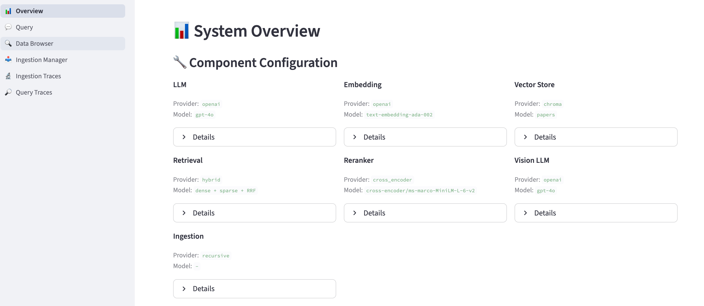

# Paper RAG — 论文智能问答系统

**English** | [中文](#中文说明)

An academic paper Q&A system built on RAG (Retrieval-Augmented Generation). Upload PDFs, ask questions, and get answers grounded in the actual paper content — with full observability through a multi-page dashboard.

---

## Screenshots / 界面预览



---

## Key Features / 核心功能

| Feature | Description |
|---------|-------------|
| Hybrid Retrieval | Dense (vector) + Sparse (BM25) + RRF fusion — balances semantic and keyword matching |
| Multimodal Ingestion | Extracts images from PDFs, describes them with Vision LLM, enables image-content search |
| Observable Dashboard | 6-page Streamlit UI: ingestion, chat query, trace inspection, data browsing |
| MCP Protocol | Exposes the knowledge base to Claude Desktop and other MCP-compatible clients |
| One-command Setup | Interactive `setup.py` wizard writes `.env` + `config/settings.yaml`, then starts the server |

---

## Quick Start / 快速开始

### 1. Clone

```bash
git clone git@github.com:HUYI999/paper-rag.git
cd paper-rag
```

### 2. Configure & Launch

```bash
python setup.py
```

The wizard prompts for LLM provider, Embedding, Vision LLM, Reranker, and launch mode. It writes all config and starts the service automatically.

### 3. Open Dashboard

```
http://localhost:8501
```

---

## Dashboard Pages / Dashboard 页面

| Page | Function |
|------|----------|
| Overview | Component configuration (LLM / Embedding / VectorStore) + trace statistics |
| Query | Chat interface — asks questions, shows answers with cited sources |
| Data Browser | Browse ingested documents and chunk content |
| Ingestion Manager | Upload PDFs, 6-stage pipeline with progress bar, delete documents |
| Ingestion Traces | Step-by-step trace of each ingestion (Load → Chunk → Transform → Encode → Store) |
| Query Traces | Retrieval path per query (Dense / Sparse / RRF / Rerank scores) |

---

## Architecture / 系统架构

```
PDF Papers
  ↓
[Ingestion Pipeline]
  ├─ Parse PDF → extract text + images
  ├─ Text chunking (recursive, chunk=1000, overlap=200)
  ├─ Vision LLM → image descriptions injected into chunks
  └─ Dual-path encoding
       ├─ ChromaDB  ← semantic vectors
       └─ BM25 index ← keyword inverted index

User Query
  ↓
[Query Pipeline]
  ├─ Dense retrieval  ← semantic similarity
  ├─ Sparse retrieval ← keyword match (BM25)
  ├─ RRF fusion  (score = 1/(k+rank_dense) + 1/(k+rank_sparse))
  ├─ Reranker (optional, Cross-Encoder / LLM)
  └─ LLM answer generation (grounded in retrieved chunks)
```

---

## Run Without Docker / 不用 Docker 直接运行

```bash
pip install -r requirements.txt
cp .env.example .env   # fill in API keys
streamlit run src/observability/dashboard/app.py
```

---

## MCP Integration / MCP 接入

Add to Claude Desktop config:

```json
{
  "mcpServers": {
    "paper-rag": {
      "command": "python",
      "args": ["src/mcp_server/server.py"],
      "cwd": "/path/to/paper-rag"
    }
  }
}
```

Restart Claude Desktop — the local knowledge base becomes directly callable from chat.

---

## Configuration / 配置说明

Edit `config/settings.yaml`:

| Key | Description | Default |
|-----|-------------|---------|
| `llm.provider` | LLM provider (openai / ollama / deepseek / azure) | openai |
| `llm.model` | Model name | gpt-4o |
| `embedding.model` | Embedding model | text-embedding-ada-002 |
| `vision_llm.enabled` | Parse images in PDFs | true |
| `rerank.enabled` | Enable reranking | false |
| `rerank.provider` | Reranker (cross_encoder / llm) | cross_encoder |
| `ingestion.chunk_size` | Chunk size (chars) | 1000 |
| `ingestion.chunk_overlap` | Overlap between chunks | 200 |

---

## Tech Stack / 技术栈

Python · ChromaDB · BM25 · OpenAI API · Streamlit · MCP Protocol · Docker

---

<a name="中文说明"></a>

## 中文说明

基于 RAG（检索增强生成）的学术论文智能问答系统。将论文预先存入知识库，提问时精准检索相关片段，避免将整篇论文喂给 LLM 产生幻觉。

### 核心功能

- **混合检索**：向量语义检索 + BM25 关键词检索，通过 RRF 融合
- **多模态支持**：自动提取 PDF 图片，用 Vision LLM 生成描述，支持"问文找图"
- **可观测 Dashboard**：6 页面 Streamlit 界面，覆盖摄入、查询、追踪、数据浏览
- **MCP 接入**：Claude Desktop 等 AI 工具可直接调用本地知识库
- **一键部署**：交互式向导配置后即可运行，支持 Docker

### 快速开始

```bash
git clone git@github.com:HUYI999/paper-rag.git
cd paper-rag
python setup.py   # 按提示配置，自动启动
```

浏览器访问 [http://localhost:8501](http://localhost:8501)

### Dashboard 页面

| 页面 | 功能 |
|------|------|
| Overview | 当前组件配置 + Trace 统计 |
| Query | 对话查询，展示答案和引文来源 |
| Data Browser | 浏览已入库文档和 Chunk 内容 |
| Ingestion Manager | 上传 PDF，6 阶段摄入管道，支持删除 |
| Ingestion Traces | 每次摄入的详细链路追踪 |
| Query Traces | 每次查询的检索路径和评分 |
